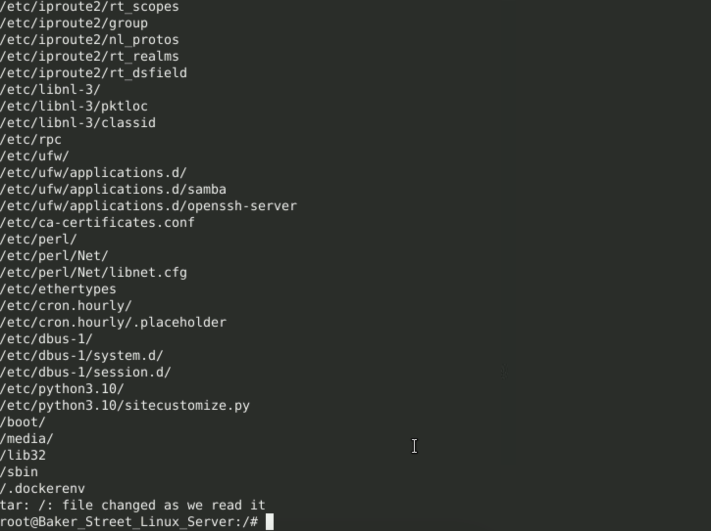
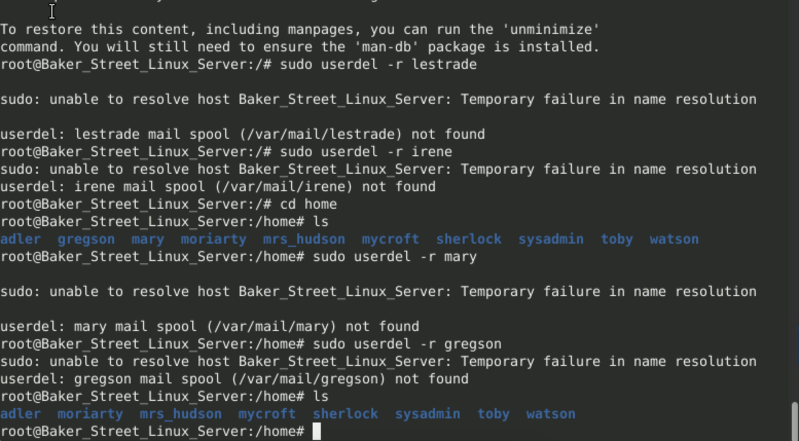
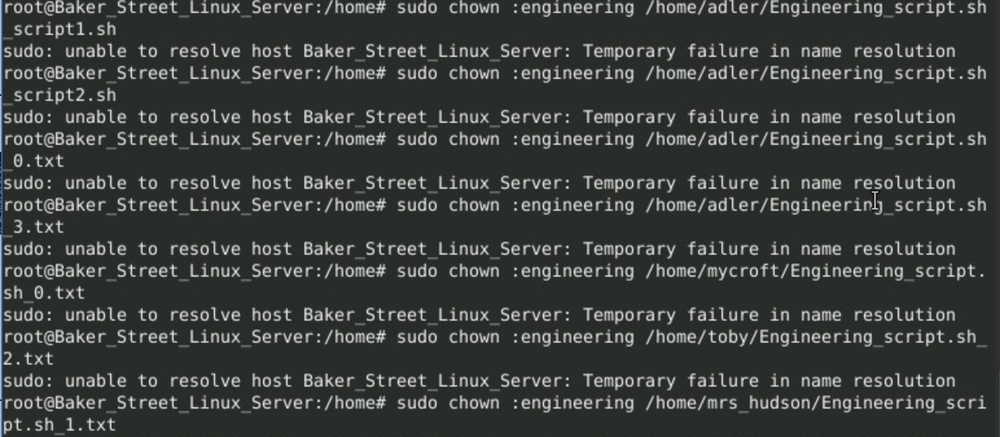
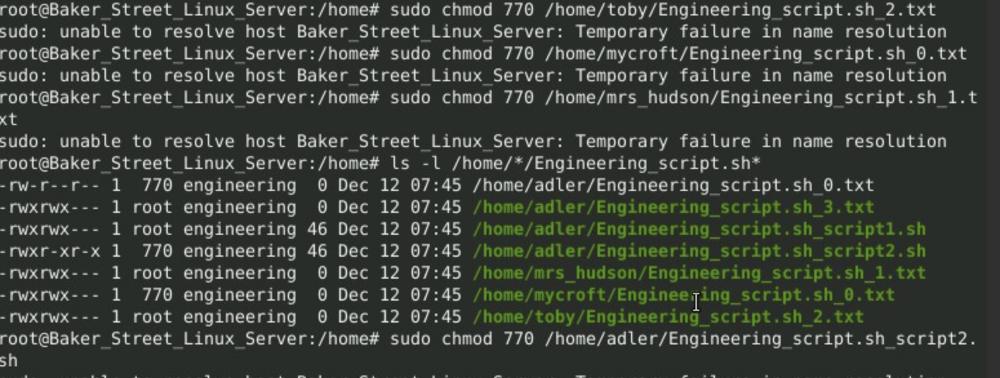
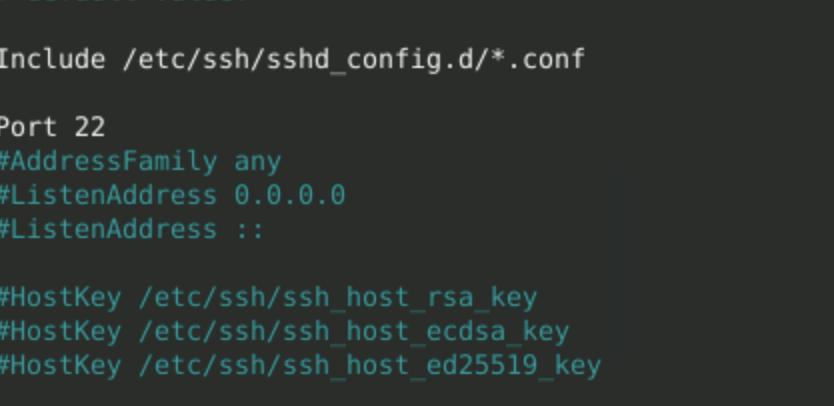
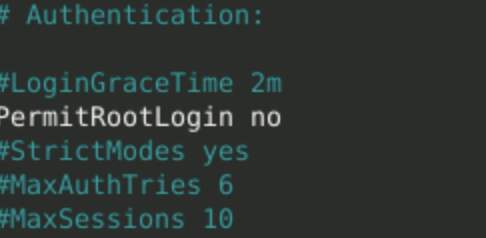
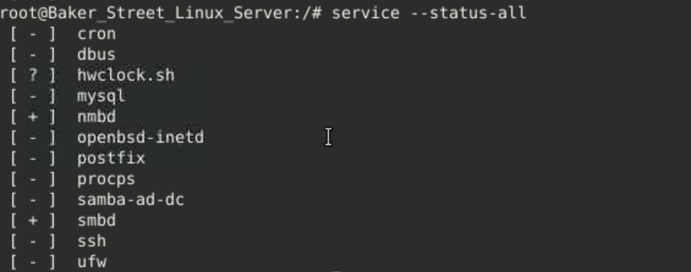
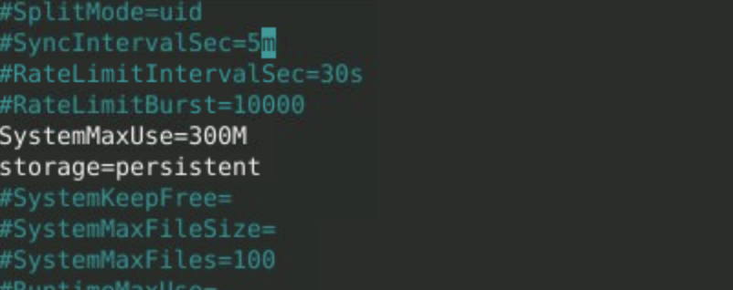
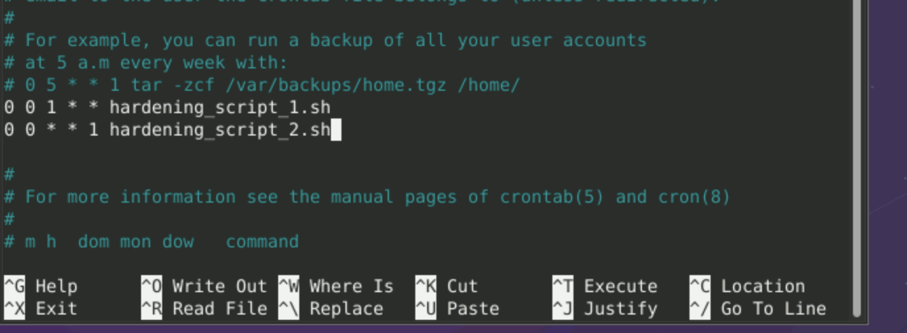

OS Information

|     |     |
| --- | --- |
| Customer | Baker Street Corporation |
| Hostname | Baker\_Street\_Linux\_Server |
| OS Version | Ubuntu 22.04.5 LTS (Jammy Jellyfish) |
| Memory information | Total 15Gi, used 1.4Gi, free 8.4Gi, shared 198Mi, buff/cache 5.6Gi, available 13Gi |
| Uptime information | 00:12:06 up 26 min,  0 users,  load average: 1.22, 1.24, 1.03 |

Checklist

|     |     |     |
| --- | --- | --- |
| Completed | Activity | Script(s) used / Tasks completed / Screenshots |
|     |     |     |
|     | OS backup | *   HostName (command =hostname) *   OS version (command =cat /etc/os-release) *   Memory information  (command= free -h) *   Uptime information (command =uptime)    sudo tar -cvpzf /baker\_street\_backup.tar.gz --exclude=/baker\_street\_backup.tar.gz --exclude=/proc --exclude=/tmp --exclude=/mnt --exclude=/sys --exclude=/dev --exclude=/run /   |
|     | Auditing users and groups | 1.  Remove users, home directory and files  (command= sudo userdel -r mary, lestrade, irene, gregson)    2.  Lock users  (command = sudo passwd -S moriarty, mrs\_hudson)    3.  Unlock users  (command = sudo passwd -u sherlock, watson, mycroft, toby, adler)  *   Toby and adler = create password (sudo pass -S \_\_ ) then unlocked    5\. Create a research group  (command= sudo groupadd research) and add users to group (no members because none in marketing)  6\. Remove marketing group  (command= sudo groupdel marketing)   |
|     | Updating and enforcing password policies | 1.  Update the password requirements for all users to have:  (command =sudo nano/etc/pam.d/common-password)   |
|     | Updating and enforcing sudo permissions | 1.  Sudo visudo  *   Removed full sudo privileges beside Sherlocke *   Watson and Mycroft should only have sudo privileges (script =watson  ALL=(ALL) NOPASSWD: /var/log/logcleanup.sh  mycroft  ALL=(ALL) NOPASSWD: /var/log/logcleanup.sh)  *   All employees who belong to the research group should have sudo privileges (script=  %research  ALL=(ALL) NOPASSWD: /tmp/scripts/research\_script.sh)  *    |
|     | Validating and updating permissions on files and directories | 1.  In every user’s home directory, there should be no files that have any world permissions to read, write, or execute.  *   Find any of them and update to remove the world permissions.  (command= find /home -type f -perm 777 -exec chmod 770 {} \\;)  2.  Revised shorter script (command =  find /home  -type f -iname '\*engineering\*' -exec chown :engineering {} +  find /home -type f  -iname '\*engineering\*' -exec chmod 770 {} +  *   Engineering scripts (command = find ./ -type f -iname “\*engineering\*”)    *   Change ownership (command=sudo chown 770 /home/mycroft/Engineering\_script.sh\_0.txt (etc)    *   Change permission (command =Sudo chmod 770 /home/toby/Engineering\_script.sh\_2.txt (etc) *   Check ( command =ls -l /home/\*/Engineering\_script.sh\*)      3.  Nothing in research 4.  Revised shorter (command=  find /home type f  -iname '\*finance\*' -exec chown :finance {} +  find /home type f  -iname '\*finance\*' -exec chmod 770 {} +        5.  Some employees may leave files with hidden passwords. Find those files and remove them  (command= john /etc/shadow) crack the passwords    (command= find ./ -type f -iname "\*.txt\*") search all files in users’ home directories for the password    *   No hidden files with passwords |
|     | Optional: Updating password hashing configuration |     |
|     | Auditing and securing SSH | 1.  Configure SSH to not allow the ability to:  1.  SSH with empty passwords 2.  SSH with the root user 3.  SSH with any other ports besides 22  2.  Enable SSH protocol 2. 3.  Restart the SSH service to set your updates     |
|     | Reviewing and updating system packages | 1.  Apt update  (command= sudo apt update)    2.  Update already installed packages to the latest version  (command= sudo apt upgrade -y)  3.  Create file package\_list.txt which contains all installed packages  (command = apt list --installed)  List all installed packages.    4.  Redirect list and creates package\_list.txt  (command =apt list --installed > package\_list.txt)    5.  Check  (command =cat package\_list.txt)    6.  Identify if any of the following packages are on the list as having these could introduce a security issue  (command = grep -i "telnet" package\_list.txt and grep -i "rsh-client" package\_list.txt)    7.  If they are on the list, remove those packages.  (command=sudo apt remove --purge telnet rsh-client)    Security issues:  Telnet: Sends data (including login credentials) in plaintext, making it vulnerable to man-in-the-middle attacks and packet sniffing.  RSH (Remote Shell): Also transmits data in plaintext and does not authenticate the client-server connection properly, which makes it vulnerable to eavesdropping and attacks.  8.  Remove all unnecessary dependencies of those packages  (command=sudo apt autoremove  -y)    9.  Add packages ufw, lynis,tripwire  (command =sudo apt install ufw lynis tripwire -y)    10.  Hardening features:  UFW: Enables or disables specific ports to limit access and simplifies firewall management with intuitive commands.  Lynis: Performs a security audit to detect potential threats. Provides security recommendations to harden the system. Also checks for common vulnerabilities, such as weak permissions or misconfigured services.  Tripwire: Monitors critical files for changes (e.g., system binaries, configuration files). Also  alerts administrators of any unauthorized changes, helping to detect attacks. And can aid in detecting malware and other intrusions. |
|     | Disabling unnecessary services | 1.  List out all services. Output this into a file called service\_list.txt.  (command= service --status-all > service\_list.txt)    8\. Identify if any of the following services are running: Mysql and Samba  (command= service \_\_\_ status)  9\. If any of the above services are running,  Stop them  (command= service\_\_ stop)    11\. Disable them (cannot because of systemctl)  12\. Remove them  (command= apt remove \_\_\_\_)   |
|     | Enabling and configuring logging | 1.  Use nano to edit the following settings in the file. Be sure to uncomment the lines  1.  Set “storage=persistent” 2.  Set “systemMaxUse=300M”  2\. Go into and edit file  (command= sudo nano /etc/systemd/journald.conf)      3\. To prevent logs from taking up too much space, you will need to configure log rotation.  (command=sudo nano /etc/logrotate.conf)    4\. Edit the file: /etc/logrotate.conf with the following settings:  Change the log rotation from weekly to daily.  Rotate out the logs after 7 days.   |
|     | Scripts created | Hardening\_script\_output.txt      Hardening\_script\_2\_output.txt     |
|     | Scripts scheduled with cron | *   Using cron, schedule script 1 to run Once a month on the first of the month (command crontab -e) *   Using cron, schedule script 2 to run Once a week every Monday (crontab -e)   |